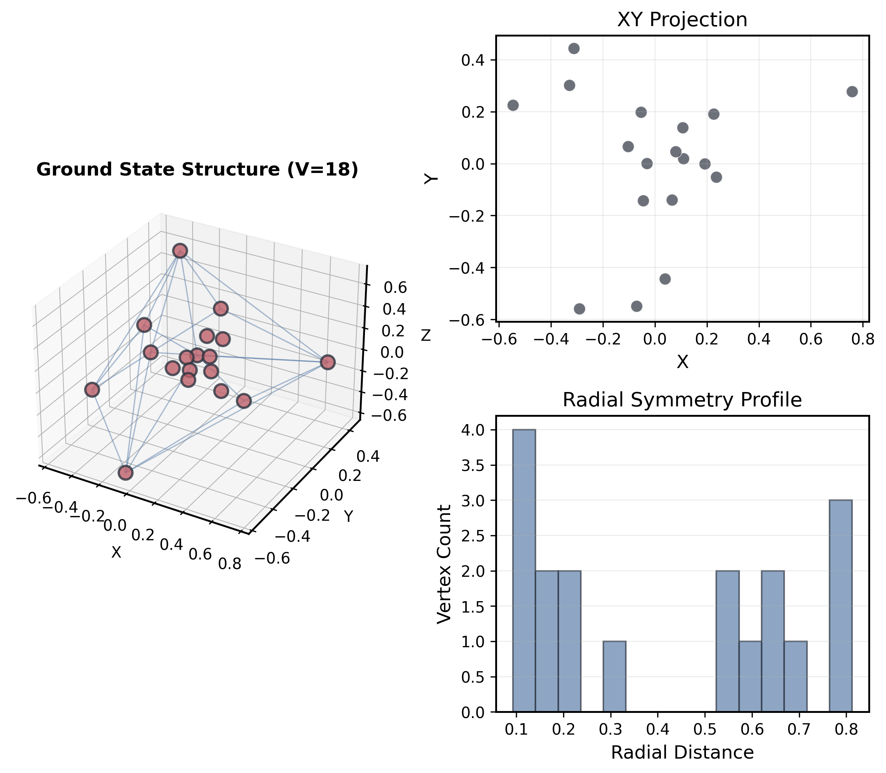

# Polytopic Archetypal Projection Protocol (PAPP)

[](https://www.gnu.org/licenses/gpl-3.0)
[](https://www.python.org/downloads/)
[](https://arxiv.org/abs/2602.xxxxx)
[](https://buymeacoffee.com/aconsciousfractal)


A computational framework for analyzing high-dimensional polytope projections into 3D space. This repository contains complete code, data, and documentation for reproducing all results from the PAPP paper.



## 🎯 Quick Start

### Prerequisites

- Python 3.8 or higher
- pip package manager
- ~2 GB free disk space (for all 1111 models)

### Installation

```bash
# Clone the repository
git clone https://github.com/aconsciousfractal/PAPP-Framework.git
cd PAPP-Framework

# Install dependencies
pip install -r requirements.txt
```

### Generate Figures (5 minutes)

```bash
cd code_src

# Generate paper figures
python generate_paper_figures.py
```

Figures will be in `paper_build/figures/`.

---

## 📊 What is PAPP?

**PAPP** (Polytopic Archetypal Projection Protocol) is a computational survey exploring how 4D polytopes project into 3D space using Grant's projection theorem.

### Key Findings

- **Ground State V=18**: Among 1111 configurations, V=18 exhibits minimal structural distortion
- **Ennead Constant**: Systematic 9-component disconnection across all configurations
- **Phi-Scaling**: Saturation curves follow golden ratio patterns
- **k² Diophantine Anomaly**: Statistical k² structure (p<0.005)

### Architecture Classes

| Class | Description | Vertex Range | Examples |
|-------|-------------|--------------|----------|
| **L** (Low-density) | Sparse, gas-like | V=5-30 | 5-cell, low phi-gaps |
| **B** (Balanced) | Liquid crystal | V=31-150 | Intermediate structures |
| **C** (Compact) | Dense, solid | V=151+ | 600-cell family |

### Phase States

- **Amorphous Gas**: Crystallinity < 0.3
- **Liquid Crystal**: 0.3 ≤ Crystallinity < 0.7
- **Solid Crystal**: Crystallinity ≥ 0.7

---

## 📁 Repository Structure

```
PAPP-Framework/
├── README.md                    # This file
├── CODE_OF_CONDUCT.md           # Community standards
├── LICENSE                      # GNU GPL v3 (code) + CC BY 4.0 (data/paper)
├── requirements.txt             # Python dependencies
├── CITATION.cff                 # Citation metadata
│
├── paper/                       # Paper manuscript
│   ├── PAPP_arxiv.tex
│   ├── PAPP_arxiv.pdf
│   └── references.bib
│
├── code_src/                    # All source code
│   ├── README.md                # Code documentation
│   │
│   ├── Model Generation:
│   ├── batch_quantum_metrics.py              # Generate 1111 models
│   ├── batch_generate_pantheon_metrics.py    # Generate Pantheon
│   ├── generate_e6_soul.py                   # E6 lattice (72V)
│   ├── generate_e8_gosset.py                 # E8 lattice (240V)
│   ├── metatron_universal_projector.py       # n=101-200 search
│   │
│   ├── Data Analysis:
│   ├── physical_state_census.py              # Physical properties
│   ├── spectral_census.py                    # Laplacian analysis
│   ├── phylogenetic_tree_generator.py        # Family classification
│   │
│   ├── Figure Generation:
│   ├── generate_paper_figures.py             # Figures
│   │
│   └── Pipeline (PAPP Protocol):
│       ├── ghost_gen.py                      # Phase 1
│       ├── geo_sieve.py                      # Phase 2
│       └── rosetta_stone.py                  # Phase 3
│
│   ├── Polychora Generation:
│   ├── generate_all_regular_polytopes_4d.py  # Generate 6 regular 4-polytopes
│   ├── polychoron_projector.py               # Analytical 4D coordinates
│   └── polychoron_combinatorics_4d.py        # Topology enumeration engine
│
├── assets/                      # Generated 3D models
│   ├── models_obj/
│   │   ├── 1111 obj/                          # 2350+ OBJ files (all configurations)
│   │   ├── Post_n100_332 New_Species/        # Extended search (332 files)
│   │   ├── *_semantic_QUANTUM_METRIC.obj     # Pantheon (6 polytopes)
│   │   ├── E6_Soul_QUANTUM_METRIC.obj
│   │   ├── E8_Gosset_QUANTUM_METRIC v240.obj
│   │   └── Polychora/                        # Regular 4D Polytopes (Validation)
│   │       ├── 5-cell_COMPLETE_4D.obj
│   │       ├── 8-cell_COMPLETE_4D.obj
│   │       ├── ...
│   │       └── 600-cell_COMPLETE_4D.obj
│   │
│   └── plots_img/               # Pre-generated plots
│       ├── MAPPA_MUNDI.png
│       └── METATRON_MASS_DISTRIBUTION.png
│
├── data/                        # Census datasets
│   ├── PHYLOGENY_CENSUS.csv     # 1111 rows - family classification
│   ├── PHYSICAL_CENSUS.csv      # 1111 rows - physical properties
│   ├── SPECTRAL_CENSUS.csv      # 1111 rows - spectral analysis
│   └── SATURATION_DATA.csv      # Saturation curve data
│
├── paper_build/                 # Generated outputs
│   └── figures/                 # Figures used by the paper (PNG)
│       ├── Fig1_GroundState_V18.png
│       ├── Fig2_Saturation_Curve.png
│       ├── Fig3_Pantheon_Spectrum.png
│       ├── Fig4_Spectral_Phases.png
│       ├── Fig5_V_Distribution.png
│       ├── Fig6_Component_Structure.png
│       ├── component_count_validation.png
│       └── optimal_phase_boundaries.png
│
├── docs/                        # Additional documentation
│   ├── INSTALLATION.md          # Detailed installation guide
│   ├── REPRODUCTION.md          # Full reproduction steps
│   └── API.md                   # Code API reference
│
└── examples/                    # Usage examples
  ├── quickstart.py            # Quick start script
    
```

---

## 🚀 Usage

### Reproduce All Results (4 hours)

Complete pipeline from scratch:

```bash
cd code_src

# Step 1: Generate 1111 quantum metrics (~45 min)
python batch_quantum_metrics.py

# Step 2: Generate Pantheon polytopes (~10 min)
python batch_generate_pantheon_metrics.py

# Step 3: Generate E6/E8 lattices (~5 min)
python generate_e6_soul.py
python generate_e8_gosset.py

# Step 4: Extended search n=101-200 (~2 hours)
python metatron_universal_projector.py --n_min 101 --n_max 200

# Step 5: Generate census data (~30 min)
python physical_state_census.py
python spectral_census.py
python phylogenetic_tree_generator.py

# Step 6: Generate all figures (~5 min)
python generate_paper_figures.py
```

### Quick Examples

#### Load and Visualize a Model

```python
import numpy as np
from mpl_toolkits.mplot3d import Axes3D
import matplotlib.pyplot as plt

# Load V=18 ground state
vertices = []
with open("assets/models_obj/1111 obj/1111 obj Quantum Metrics/Element_V18_phi_gap_5_5_5_5_QUANTUM_METRIC.obj") as f:
    for line in f:
        if line.startswith('v '):
            vertices.append([float(x) for x in line.split()[1:4]])

vertices = np.array(vertices)

# 3D plot
fig = plt.figure()
ax = fig.add_subplot(111, projection='3d')
ax.scatter(vertices[:, 0], vertices[:, 1], vertices[:, 2])
plt.show()
```

#### Analyze Census Data

```python
import pandas as pd

# Load physical census
df = pd.read_csv("data/PHYSICAL_CENSUS.csv")

# Find ground state
ground_state = df.loc[df['V_Total'].idxmin()]
print(f"Ground State: V={ground_state['V_Total']}")
print(f"Crystallinity: {ground_state['Crystallinity_Index']:.3f}")
print(f"Phase: {ground_state['Phase_State']}")

# Statistics by phase
phase_stats = df.groupby('Phase_State')['V_Total'].describe()
print(phase_stats)
```

---

## 📖 Documentation

- **[Installation Guide](docs/INSTALLATION.md)**: Detailed setup instructions
- **[Reproduction Guide](docs/REPRODUCTION.md)**: Step-by-step reproduction
- **[Code Documentation](code_src/README.md)**: Script documentation
- **[API Reference](docs/API.md)**: Function and module documentation
- **[Paper](paper/)**: Full manuscript (Markdown + LaTeX)

### Key Concepts

- **Hopf Fibration**: 4D → 3D projection mechanism
- **Quantum Metric**: Overlay of geometric and spectral properties
- **Phi-Gap**: Parameter [k₁, k₂, k₃, k₄] defining polytope structure
- **Crystallinity Index**: Measure of structural order (0=amorphous, 1=perfect crystal)

---

## 🔬 Scientific Context

### Related Work

- **Grant's Projection Theorem** (2024): Theoretical foundation for 4D→3D mappings
- **Hopf Fibration** (1931): Classical fiber bundle structure
- **Coxeter's Regular Polytopes** (1973): 4D polytope classification
- **Conway & Sloane** (1988): Sphere packings and E₈ lattices

### Applications

- **Crystallography**: Quasicrystal structure prediction
- **Physics**: E₈ lattice connections in string theory
- **Number Theory**: Diophantine approximation patterns
- **Computer Graphics**: High-dimensional visualization

---

## 📊 Datasets

All data files are in CSV format with headers:

### PHYSICAL_CENSUS.csv (1111 rows)

| Column | Description |
|--------|-------------|
| `V_Total` | Total vertex count |
| `Volume_4D` | 4D polytope volume |
| `Volume_3D` | 3D projection volume |
| `Sphericity` | Sphericity index (0-1) |
| `Density` | Vertices per unit volume |
| `Crystallinity_Index` | Structural order (0-1) |
| `Phase_State` | Amorphous Gas / Liquid Crystal / Solid Crystal |

### SPECTRAL_CENSUS.csv (1111 rows)

| Column | Description |
|--------|-------------|
| `Zero_Modes` | Number of zero eigenvalues |
| `Fundamental_Freq` | Lowest non-zero eigenvalue |
| `Spectral_Gap` | Gap between first two eigenvalues |
| `Eigenvalue_Spectrum` | Full spectrum (JSON array) |

### PHYLOGENY_CENSUS.csv (1111 rows)

| Column | Description |
|--------|-------------|
| `Family_ID` | Phylogenetic family (1-5) |
| `Distance_To_Centroid` | Euclidean distance to family center |
| `Similarity_Score` | Structural similarity within family |

---

## 🤝 Contributing

We welcome contributions! **Please note: Contributors must sign our [Contributor License Agreement (CLA)](CLA.md) before code can be merged.**

See our guides:

- **[CLA](CLA.md)**: Sign before contributing (required)
- **[CONTRIBUTING.md](CONTRIBUTING.md)**: Contribution guidelines
- **[CODE_OF_CONDUCT.md](CODE_OF_CONDUCT.md)**: Community standards
- **GitHub Issues**: Report bugs or request features
- **Pull Requests**: Submit improvements

---

## 📄 Citation

If you use PAPP in your research, please cite:

```bibtex
@article{Babanskyy2026PAPP,
  author  = {Babanskyy, Oleksiy},
  title   = {Polytopic Archetypal Projection Protocol (PAPP): A Computational Survey of High-Dimensional Polytope Projections},
  year    = {2026},
  journal = {arXiv preprint},
  eprint  = {arXiv:2602.xxxxx},
  url     = {https://arxiv.org/abs/2602.xxxxx}
}
```

**APA Format**:
```
Babanskyy, O. (2026). Polytopic Archetypal Projection Protocol (PAPP): A Computational Survey of High-Dimensional Polytope Projections. arXiv preprint arXiv:2602.xxxxx.
```

---

## 📜 License

This project is licensed under the **GNU General Public License v3.0** - see the [LICENSE](LICENSE) file for details.

- **Code**: GNU GPL v3 (free software, copyleft)
- **Data**: CC BY 4.0 (attribution required)
- **Paper**: CC BY 4.0 (attribution required)

---

## 🌐 Links

- **arXiv**: https://arxiv.org/abs/2602.xxxxx (coming soon)
- **GitHub**: https://github.com/aconsciousfractal/PAPP-Framework
- **Author ORCID**: https://orcid.org/0009-0001-6176-6208

---

## 📧 Contact

**Oleksiy Babanskyy**
- Email: aconsciousfractal@gmail.com
- GitHub: [@aconsciousfractal](https://github.com/aconsciousfractal)
- ORCID: https://orcid.org/0009-0001-6176-6208

For questions, issues, or collaboration inquiries, please open a GitHub issue or contact directly.

---

## 🙏 Acknowledgments

- Robert Edward Grant for projection theorem foundations
- Heinz Hopf for fiber bundle theory
- The computational geometry community for inspiration

---

## 📈 Project Status

- ✅ Complete 1111-configuration survey
- ✅ Figures available (see `paper_build/figures/`)
- ✅ Census data published
- ✅ Code fully reproducible
- ⏳ arXiv submission (in progress)
- ⏳ Peer review submission (planned)
- 🔄 Extended n=101-200 analysis (ongoing)

---

**Last Updated**: 2026-02-10  
**Version**: 1.0 (Preprint v2.0)

---

<p align="center">
  Made with ❤️ for open science
</p>
